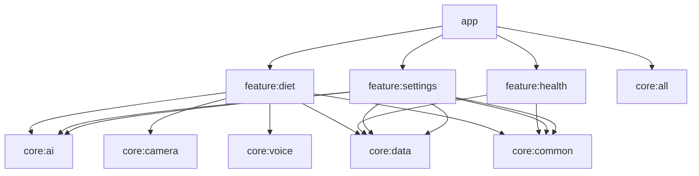

# 🏗️ 03 — 技术架构文档

> 版本：v1.0 | 日期：2026-06-25 | 状态：初稿

---

## 1. 架构总览

### 1.1 分层架构

```
┌─────────────────────────────────────────────────────────────┐
│                       📱 Presentation Layer                  │
│  ┌──────────┐ ┌──────────┐ ┌──────────┐ ┌───────────────┐  │
│  │  Home     │ │  Diet    │ │  Health  │ │  AI / Chat    │  │
│  │  Screen   │ │  Screen  │ │  Screen  │ │  Screen       │  │
│  └────┬─────┘ └────┬─────┘ └────┬─────┘ └──────┬────────┘  │
│       │            │            │               │            │
│  ┌────┴────────────┴────────────┴───────────────┴────────┐  │
│  │              ViewModels (MVVM)                         │  │
│  │  持有 UiState, 调用 UseCase, 响应 UI 事件               │  │
│  └────────────────────────┬──────────────────────────────┘  │
├───────────────────────────┼──────────────────────────────────┤
│                      🧠 Domain Layer                          │
│  ┌────────────────────────┼──────────────────────────────┐  │
│  │              Use Cases (用例)                          │  │
│  │  AnalyzeFoodPhoto | RecordVoiceMeal | GetDailyReport  │  │
│  │  ManageApiKey | ChatWithAI | UpdateGoal | ...         │  │
│  └────────────────────────┼──────────────────────────────┘  │
│  ┌────────────────────────┼──────────────────────────────┐  │
│  │           Repository Interfaces (仓库接口)              │  │
│  │  FoodRepository | HealthRepository | AiRepository     │  │
│  │  UserRepository | SettingsRepository                  │  │
│  └────────────────────────┼──────────────────────────────┘  │
│  ┌────────────────────────┼──────────────────────────────┐  │
│  │              Domain Models                             │  │
│  │  FoodRecord | MealLog | HealthMetric | UserGoal       │  │
│  │  AiProvider | ApiKeyConfig | NutritionInfo            │  │
│  └────────────────────────┼──────────────────────────────┘  │
├───────────────────────────┼──────────────────────────────────┤
│                      💾 Data Layer                            │
│  ┌────────────────────────┼──────────────────────────────┐  │
│  │          Repository Implementations                    │  │
│  └────┬───────────────────┼──────────────────┬───────────┘  │
│       │                   │                   │               │
│  ┌────┴──────┐   ┌───────┴────────┐  ┌──────┴──────────┐   │
│  │  Local    │   │   Remote       │  │  System Services │   │
│  │  Room DB  │   │   AI API 适配器 │  │  CameraX, ASR   │   │
│  │  DataStore│   │   Retrofit     │  │  Health Connect  │   │
│  │           │   │                │  │  (手环数据同步)   │   │
│  └───────────┘   └────────────────┘  └─────────────────┘   │
└─────────────────────────────────────────────────────────────┘
```

### 1.2 架构原则

| 原则 | 说明 |
|------|------|
| **依赖倒置** | 高层模块不依赖低层模块，二者依赖抽象（接口） |
| **单一数据源** | Room 数据库是数据的唯一真实来源（Single Source of Truth） |
| **单向数据流** | UI → ViewModel → UseCase → Repository → DataSource → 返回 Flow |
| **关注分离** | 每层职责明确，修改展示层不影响数据层 |
| **可测试性** | 每层可独立单元测试，依赖通过接口 Mock |

---

## 2. 技术栈详解

### 2.1 核心技术栈

```kotlin
// Gradle Catalog (libs.versions.toml)

[versions]
kotlin = "2.1.0"
compose-bom = "2025.06.00"
compose-compiler = "1.5.15"
room = "2.7.0"
hilt = "2.52"
retrofit = "2.11.0"
okhttp = "4.12.0"
camerax = "1.4.1"
coil = "3.0.4"
vico = "2.1.0"
datastore = "1.1.1"
security-crypto = "1.1.0-alpha06"
kotlinx-serialization = "1.7.3"
kotlinx-coroutines = "1.9.0"

[libraries]
# Compose BOM
compose-bom = { group = "androidx.compose", name = "compose-bom", version.ref = "compose-bom" }
compose-material3 = { group = "androidx.compose.material3", name = "material3" }
compose-navigation = { group = "androidx.navigation", name = "navigation-compose", version = "2.8.5" }
compose-lifecycle = { group = "androidx.lifecycle", name = "lifecycle-runtime-compose", version = "2.8.7" }

# Room
room-runtime = { group = "androidx.room", name = "room-runtime", version.ref = "room" }
room-compiler = { group = "androidx.room", name = "room-compiler", version.ref = "room" }
room-ktx = { group = "androidx.room", name = "room-ktx", version.ref = "room" }

# Hilt
hilt-android = { group = "com.google.dagger", name = "hilt-android", version.ref = "hilt" }
hilt-compiler = { group = "com.google.dagger", name = "hilt-android-compiler", version.ref = "hilt" }
hilt-navigation-compose = { group = "androidx.hilt", name = "hilt-navigation-compose", version = "1.2.0" }

# Network
retrofit = { group = "com.squareup.retrofit2", name = "retrofit", version.ref = "retrofit" }
okhttp = { group = "com.squareup.okhttp3", name = "okhttp", version.ref = "okhttp" }
okhttp-logging = { group = "com.squareup.okhttp3", name = "logging-interceptor", version.ref = "okhttp" }
kotlinx-serialization-json = { group = "org.jetbrains.kotlinx", name = "kotlinx-serialization-json", version.ref = "kotlinx-serialization" }
retrofit-kotlinx-serialization = { group = "com.squareup.retrofit2", name = "converter-kotlinx-serialization", version.ref = "retrofit" }

# CameraX
camerax-core = { group = "androidx.camera", name = "camera-core", version.ref = "camerax" }
camerax-camera2 = { group = "androidx.camera", name = "camera-camera2", version.ref = "camerax" }
camerax-lifecycle = { group = "androidx.camera", name = "camera-lifecycle", version.ref = "camerax" }
camerax-view = { group = "androidx.camera", name = "camera-view", version.ref = "camerax" }

# Image Loading
coil-compose = { group = "io.coil-kt.coil3", name = "coil-compose", version.ref = "coil" }

# Charts
vico-compose = { group = "com.patrykandpatrick.vico", name = "compose-m3", version.ref = "vico" }

# Security
security-crypto = { group = "androidx.security", name = "security-crypto", version.ref = "security-crypto" }

# DataStore
datastore-preferences = { group = "androidx.datastore", name = "datastore-preferences", version.ref = "datastore" }
```

### 2.2 开发环境

| 工具 | 版本/说明 |
|------|-----------|
| Android Studio | Hedgehog 2024.1.1+ |
| Kotlin | 2.1.0 |
| Gradle | 8.9+ |
| JDK | 17 (Temurin) |
| Min SDK | 26 (Android 8.0) |
| Target SDK | 35 (Android 15) |
| Compile SDK | 35 |

---

## 3. 模块划分

### 3.1 Gradle 模块结构

```
root/
├── app/                          # 主应用模块
│   └── 包含 DI 组装、导航、Application 类
│
├── core/
│   ├── ai/                       # AI 适配层（独立模块）
│   │   ├── api/                  # 统一 AiService 接口定义
│   │   ├── deepseek/             # DeepSeek 适配器
│   │   ├── kimi/                 # Kimi (Moonshot) 适配器
│   │   ├── qwen/                 # 通义千问 适配器
│   │   ├── glm/                  # 智谱 GLM 适配器
│   │   └── custom/               # 自定义 OpenAI 兼容适配器
│   │
│   ├── camera/                   # 相机封装
│   │   ├── CameraController      # CameraX 生命周期管理
│   │   └── ImageProcessor        # 图片压缩/旋转/裁剪
│   │
│   ├── voice/                    # 语音服务封装
│   │   ├── SpeechRecognizer      # ASR 封装
│   │   └── TextToSpeech          # TTS 封装（后续）
│   │
│   ├── data/                     # 本地数据层
│   │   ├── database/             # Room 数据库定义
│   │   ├── dao/                  # DAO 接口
│   │   ├── entity/               # 数据库实体
│   │   └── datastore/            # DataStore 偏好存储
│   │
│   └── common/                   # 通用工具
│       ├── extensions/           # Kotlin 扩展函数
│       ├── result/               # 统一结果封装
│       └── ui/                   # 通用 UI 组件
│
└── feature/                      # 功能模块（按需懒加载）
    ├── diet/                     # 饮食管理
    ├── health/                   # 健康追踪（含 Health Connect 集成）
    └── settings/                 # 设置与配置（含 API Key 管理）
```

### 3.2 模块依赖关系



---

## 4. 核心数据模型

### 4.1 数据库实体（Room Entities）

```kotlin
// === 饮食记录 ===

@Entity(tableName = "food_records")
data class FoodRecordEntity(
    @PrimaryKey(autoGenerate = true) val id: Long = 0,
    val mealType: MealType,          // BREAKFAST, LUNCH, DINNER, SNACK
    val recordDate: LocalDate,        // 记录日期
    val recordTime: LocalTime,        // 记录时间
    val foodName: String,             // 食物名称
    val portion: Double,              // 份量
    val portionUnit: String,          // 单位（g, ml, 份, 碗, 个）
    val calories: Double,             // 热量 (kcal)
    val proteinGrams: Double,         // 蛋白质 (g)
    val carbsGrams: Double,           // 碳水 (g)
    val fatGrams: Double,             // 脂肪 (g)
    val fiberGrams: Double = 0.0,     // 纤维 (g)
    val imageUri: String? = null,     // 关联照片 URI
    val source: RecordSource,         // CAMERA, VOICE, MANUAL, AI_CHAT
    val aiModel: String? = null,      // 使用的 AI 模型
    val note: String? = null,         // 备注
    val createdAt: Long = System.currentTimeMillis(),
    val updatedAt: Long = System.currentTimeMillis()
)

// === 健康指标 ===

@Entity(tableName = "health_metrics")
data class HealthMetricEntity(
    @PrimaryKey(autoGenerate = true) val id: Long = 0,
    val metricType: MetricType,       // WEIGHT, EXERCISE, WATER, BODY_FAT, etc.
    val value: Double,
    val unit: String,
    val recordDate: LocalDate,
    val recordTime: LocalTime,
    val note: String? = null,
    val createdAt: Long = System.currentTimeMillis()
)

// === 用户目标 ===

@Entity(tableName = "user_goals")
data class UserGoalEntity(
    @PrimaryKey val id: Long = 1,     // 单例记录
    val dailyCalories: Double = 2000.0,
    val proteinTarget: Double = 60.0,  // g
    val carbsTarget: Double = 250.0,   // g
    val fatTarget: Double = 65.0,      // g
    val weightGoal: Double? = null,    // kg
    val goalType: GoalType = GoalType.MAINTAIN, // LOSE, MAINTAIN, GAIN
    val updatedAt: Long = System.currentTimeMillis()
)

// === AI 配置 ===

@Entity(tableName = "ai_providers")
data class AiProviderEntity(
    @PrimaryKey val id: String,        // "openai", "anthropic", etc.
    val displayName: String,
    val apiKeyEncrypted: String,       // 加密后的 API Key
    val baseUrl: String,
    val isEnabled: Boolean = true,
    val defaultVisionModel: String? = null,
    val defaultChatModel: String? = null,
    val createdAt: Long = System.currentTimeMillis()
)
```

### 4.2 领域模型（Domain Models）

```kotlin
// 领域模型与数据实体分离
data class FoodRecord(
    val id: Long,
    val mealType: MealType,
    val dateTime: LocalDateTime,
    val food: FoodItem,
    val source: RecordSource,
    val imageUri: String?,
    val aiModel: String?,
    val note: String?
)

data class FoodItem(
    val name: String,
    val portion: Portion,
    val nutrition: NutritionInfo
)

data class Portion(
    val amount: Double,
    val unit: PortionUnit
)

data class NutritionInfo(
    val calories: Double,      // kcal
    val proteinGrams: Double,
    val carbsGrams: Double,
    val fatGrams: Double,
    val fiberGrams: Double = 0.0
)

data class DailyNutrition(
    val date: LocalDate,
    val totalCalories: Double,
    val totalProtein: Double,
    val totalCarbs: Double,
    val totalFat: Double,
    val meals: List<FoodRecord>,
    val goalProgress: GoalProgress
)

data class GoalProgress(
    val caloriesPercent: Float,   // 0.0 ~ 1.0+
    val proteinPercent: Float,
    val carbsPercent: Float,
    val fatPercent: Float
)
```

### 4.3 枚举类型定义

```kotlin
enum class MealType { BREAKFAST, LUNCH, DINNER, SNACK }

enum class RecordSource { CAMERA, VOICE, MANUAL, AI_CHAT }

enum class MetricType { WEIGHT, EXERCISE_MINUTES, WATER_ML, BODY_FAT_PCT, WAIST_CM }

enum class GoalType { LOSE_FAST, LOSE_SLOW, MAINTAIN, GAIN_SLOW, GAIN_FAST }

enum class PortionUnit { GRAMS, MILLILITERS, SERVING, BOWL, PIECE, CUP, CUSTOM }

sealed class AiProviderType(val id: String) {
    // V1 国内大模型
    object DeepSeek : AiProviderType("deepseek")
    object Kimi : AiProviderType("kimi")
    object Qwen : AiProviderType("qwen")
    object GLM : AiProviderType("glm")
    // 自定义 OpenAI 兼容端点
    data class Custom(val providerId: String) : AiProviderType(providerId)
}
```

---

## 5. AI 适配层设计

### 5.1 统一接口

```kotlin
// core/ai/api/AiService.kt

interface AiService {

    /**
     * 视觉分析：识别图片中的食物
     */
    suspend fun analyzeFoodImage(
        imageBytes: ByteArray,
        mimeType: String = "image/jpeg",
        prompt: String = DEFAULT_FOOD_ANALYSIS_PROMPT
    ): Result<FoodAnalysisResult>

    /**
     * 文本对话
     */
    suspend fun chat(
        messages: List<ChatMessage>,
        systemPrompt: String? = null,
        context: Map<String, String>? = null
    ): Result<String>

    /**
     * 流式对话
     */
    fun chatStream(
        messages: List<ChatMessage>,
        systemPrompt: String? = null
    ): Flow<String>

    /**
     * 解析自然语言食物描述
     */
    suspend fun parseFoodDescription(
        text: String
    ): Result<List<FoodAnalysisResult.FoodItem>>
}

data class ChatMessage(
    val role: ChatRole,
    val content: String,          // 文本内容
    val imageBase64: String? = null // 可选的图片（多模态）
)

enum class ChatRole { SYSTEM, USER, ASSISTANT }

data class FoodAnalysisResult(
    val items: List<FoodItem>,
    val totalCalories: Double,
    val confidence: Float,        // AI 置信度 0.0 ~ 1.0
    val rawResponse: String       // 原始响应（调试用）
) {
    data class FoodItem(
        val name: String,
        val portion: Double,
        val portionUnit: String,
        val calories: Double,
        val proteinGrams: Double,
        val carbsGrams: Double,
        val fatGrams: Double,
        val confidence: Float
    )
}
```

### 5.2 适配器示例（OpenAI）

```kotlin
// core/ai/openai/OpenAiAdapter.kt

class OpenAiAdapter(
    private val apiKey: String,
    private val baseUrl: String = "https://api.openai.com/v1",
    private val okHttpClient: OkHttpClient
) : AiService {

    private val api: OpenAiApi = Retrofit.Builder()
        .baseUrl(baseUrl)
        .client(okHttpClient.newBuilder().addInterceptor {
            it.request().newBuilder()
                .addHeader("Authorization", "Bearer $apiKey")
                .build()
            .let(it::proceed)
        }.build())
        .addConverterFactory(Json.asConverterFactory("application/json".toMediaType()))
        .build()
        .create(OpenAiApi::class.java)

    override suspend fun analyzeFoodImage(
        imageBytes: ByteArray, mimeType: String, prompt: String
    ): Result<FoodAnalysisResult> = runCatching {
        val base64Image = Base64.encodeToString(imageBytes, Base64.NO_WRAP)
        val dataUrl = "data:$mimeType;base64,$base64Image"

        val request = OpenAiChatRequest(
            model = "gpt-4o",
            messages = listOf(
                OpenAiMessage(role = "user", content = listOf(
                    ContentPart(type = "text", text = prompt),
                    ContentPart(type = "image_url", imageUrl = ImageUrl(url = dataUrl))
                ))
            ),
            responseFormat = ResponseFormat(type = "json_object")
        )

        val response = api.chatCompletion(request)
        parseFoodAnalysisResponse(response.choices.first().message.content)
    }

    // ... 其他方法实现
}
```

---

## 6. 仓库模式实现

### 6.1 仓库接口

```kotlin
// domain/repository/FoodRepository.kt

interface FoodRepository {
    fun getRecordsByDate(date: LocalDate): Flow<List<FoodRecord>>
    fun getRecordsByDateRange(start: LocalDate, end: LocalDate): Flow<List<FoodRecord>>
    fun getDailyNutrition(date: LocalDate): Flow<DailyNutrition?>
    suspend fun saveRecord(record: FoodRecord): Result<Long>
    suspend fun deleteRecord(id: Long): Result<Unit>
    suspend fun updateRecord(record: FoodRecord): Result<Unit>
    suspend fun searchFoods(query: String): List<CachedFoodItem>
    suspend fun addToCache(item: CachedFoodItem): Result<Unit>
}
```

### 6.2 仓储实现

```kotlin
// data/repository/FoodRepositoryImpl.kt

class FoodRepositoryImpl(
    private val foodDao: FoodDao,
    private val cachedFoodDao: CachedFoodDao
) : FoodRepository {

    override fun getRecordsByDate(date: LocalDate): Flow<List<FoodRecord>> =
        foodDao.getRecordsByDate(date.toString())
            .map { entities -> entities.map { it.toDomain() } }

    override suspend fun saveRecord(record: FoodRecord): Result<Long> = runCatching {
        foodDao.insert(record.toEntity())
    }

    // Entity → Domain 映射
    private fun FoodRecordEntity.toDomain(): FoodRecord = FoodRecord(
        id = id,
        mealType = mealType,
        dateTime = LocalDateTime.of(recordDate, recordTime),
        food = FoodItem(
            name = foodName,
            portion = Portion(portion, PortionUnit.valueOf(portionUnit)),
            nutrition = NutritionInfo(calories, proteinGrams, carbsGrams, fatGrams, fiberGrams)
        ),
        source = source,
        imageUri = imageUri,
        aiModel = aiModel,
        note = note
    )
}
```

---

## 7. ViewModel 设计

### 7.1 UI 状态管理

```kotlin
// 首页 ViewModel 状态

data class HomeUiState(
    val todayNutrition: DailyNutrition? = null,
    val recentRecords: List<FoodRecord> = emptyList(),
    val isLoading: Boolean = false,
    val error: String? = null,
    val isAiAvailable: Boolean = false,
    val quickActions: QuickActions = QuickActions()
)

data class QuickActions(
    val showCamera: Boolean = false,
    val showVoiceRecorder: Boolean = false,
    val showManualEntry: Boolean = false,
    val showAiChat: Boolean = false
)

sealed interface HomeEvent {
    data object CaptureFood : HomeEvent
    data object StartVoiceRecord : HomeEvent
    data object OpenManualEntry : HomeEvent
    data class ConfirmFoodRecord(val result: FoodAnalysisResult) : HomeEvent
    data class DismissError(val errorId: String) : HomeEvent
}

@HiltViewModel
class HomeViewModel @Inject constructor(
    private val getDailyNutrition: GetDailyNutritionUseCase,
    private val analyzeFood: AnalyzeFoodUseCase,
    private val saveFoodRecord: SaveFoodRecordUseCase
) : ViewModel() {

    private val _uiState = MutableStateFlow(HomeUiState())
    val uiState: StateFlow<HomeUiState> = _uiState.asStateFlow()

    init {
        viewModelScope.launch {
            getDailyNutrition(LocalDate.now()).collect { nutrition ->
                _uiState.update { it.copy(todayNutrition = nutrition) }
            }
        }
    }

    fun onEvent(event: HomeEvent) {
        when (event) {
            HomeEvent.CaptureFood -> _uiState.update { it.copy(quickActions = it.quickActions.copy(showCamera = true)) }
            HomeEvent.StartVoiceRecord -> _uiState.update { it.copy(quickActions = it.quickActions.copy(showVoiceRecorder = true)) }
            // ... 其他事件处理
        }
    }
}
```

---

## 8. 依赖注入架构

### 8.1 Hilt 模块定义

```kotlin
// di/DatabaseModule.kt
@Module
@InstallIn(SingletonComponent::class)
object DatabaseModule {
    @Provides @Singleton
    fun provideDatabase(@ApplicationContext ctx: Context): FitnessDatabase =
        Room.databaseBuilder(ctx, FitnessDatabase::class.java, "fitness.db")
            .addMigrations(/* ... */)
            .build()

    @Provides fun provideFoodDao(db: FitnessDatabase) = db.foodDao()
    @Provides fun provideCachedFoodDao(db: FitnessDatabase) = db.cachedFoodDao()
    @Provides fun provideHealthMetricDao(db: FitnessDatabase) = db.healthMetricDao()
    @Provides fun provideUserGoalDao(db: FitnessDatabase) = db.userGoalDao()
}

// di/NetworkModule.kt
@Module
@InstallIn(SingletonComponent::class)
object NetworkModule {
    @Provides @Singleton
    fun provideOkHttpClient(): OkHttpClient =
        OkHttpClient.Builder()
            .connectTimeout(30, TimeUnit.SECONDS)
            .readTimeout(60, TimeUnit.SECONDS)
            .addInterceptor(HttpLoggingInterceptor().apply {
                level = if (BuildConfig.DEBUG) BODY else NONE
            })
            .build()
}

// di/AiModule.kt
@Module
@InstallIn(SingletonComponent::class)
object AiModule {
    @Provides @Singleton
    fun provideAiServiceManager(
        @ApplicationContext ctx: Context,
        okHttpClient: OkHttpClient
    ): AiServiceManager = AiServiceManager(ctx, okHttpClient)
}
```

---

## 9. 导航设计

### 9.1 导航图

```kotlin
// ui/navigation/ShiJiNavGraph.kt — 3 Tab: 首页 / 数据 / 我的

@Composable
fun ShiJiNavGraph(navController: NavHostController) {
    NavHost(navController = navController, startDestination = "home") {

        // === 首页 Tab ===
        composable("home") {
            HomeScreen(
                onNavigateToCamera = { navController.navigate("camera") },
                onNavigateToVoice = { navController.navigate("voice_recorder") },
                onNavigateToManual = { navController.navigate("manual_entry") },
                onNavigateToSettings = { navController.navigate("settings") }
            )
        }

        // === 数据 Tab ===
        composable("data") { DataScreen() }

        // === 我的 Tab ===
        composable("profile") { ProfileScreen() }

        // === 子页面 ===
        composable("camera") { CameraScreen(onResultConfirm = { /* ... */ }) }
        composable("voice_recorder") { VoiceRecorderScreen(onResultConfirm = { /* ... */ }) }
        composable("manual_entry") { ManualEntryScreen(onSaved = { /* ... */ }) }
        composable("diet_log") { DietLogScreen() }
        composable("diet_analysis") { DietAnalysisScreen() }
        composable("weight_detail") { WeightDetailScreen() }
        composable("ai_settings") { AiSettingsScreen() }
        composable("settings") { SettingsScreen() }
        composable("food_library") { FoodLibraryScreen() }
        composable("data_export") { DataExportScreen() }
    }
}
```

---

## 10. 安全设计

### 10.1 API Key 安全存储

```kotlin
// core/common/security/EncryptedKeyStore.kt

class EncryptedKeyStore(context: Context) {

    private val masterKey = MasterKey.Builder(context)
        .setKeyScheme(MasterKey.KeyScheme.AES256_GCM)
        .build()

    private val prefs = EncryptedSharedPreferences.create(
        context,
        "secure_ai_keys",
        masterKey,
        EncryptedSharedPreferences.PrefKeyEncryptionScheme.AES256_SIV,
        EncryptedSharedPreferences.PrefValueEncryptionScheme.AES256_GCM
    )

    fun saveKey(providerId: String, apiKey: String) {
        prefs.edit().putString("key_$providerId", apiKey).apply()
    }

    fun getKey(providerId: String): String? {
        return prefs.getString("key_$providerId", null)
    }

    fun deleteKey(providerId: String) {
        prefs.edit().remove("key_$providerId").apply()
    }

    fun hasKey(providerId: String): Boolean {
        return prefs.contains("key_$providerId")
    }
}
```

### 10.2 网络安全

```xml
<!-- res/xml/network_security_config.xml -->
<?xml version="1.0" encoding="utf-8"?>
<network-security-config>
    <!-- 禁止明文流量 -->
    <base-config cleartextTrafficPermitted="false">
        <trust-anchors>
            <certificates src="system" />
        </trust-anchors>
    </base-config>
    <!-- API 域名白名单（根据配置动态添加） -->
    <domain-config cleartextTrafficPermitted="false">
        <domain includeSubdomains="true">api.openai.com</domain>
        <domain includeSubdomains="true">api.anthropic.com</domain>
        <domain includeSubdomains="true">generativelanguage.googleapis.com</domain>
        <domain includeSubdomains="true">api.deepseek.com</domain>
    </domain-config>
</network-security-config>
```

---

## 11. 测试策略

| 测试类型 | 覆盖率目标 | 框架 | 说明 |
|----------|-----------|------|------|
| 单元测试 | ≥ 80% | JUnit5 + MockK | Repository, UseCase, ViewModel |
| DAO 测试 | ≥ 90% | Room In-Memory | 数据库查询正确性 |
| UI 测试 | 核心流程 100% | Compose Test | 关键页面交互 |
| 端到端测试 | 5 条核心路径 | Turbo / Espresso | 拍照→分析→保存 等 |
| 截图测试 | 关键页面 | Roborazzi | 视觉回归 |

---

> **下一篇**：[04 — AI 集成方案文档](04-ai-integration.md)
